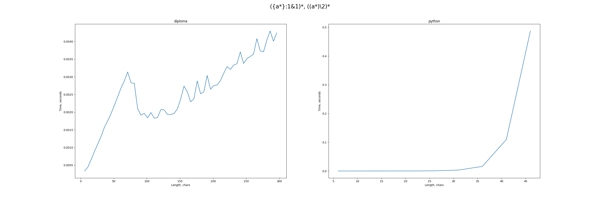

Инструкция по сборке и установке написаны под операционной системой Ubuntu 20. Перед работой в систему должны быть установлены g++, cmake, python3 и pip.

## Сборка проекта:
```
chmod +x build.sh
./build.sh
```

## Формат входных данных

На вход ожидается регулярное выражение, опционально с обратными ссылками, в следующем синтаксисе без пробелов.
```
Regexp = KleeneStar | KleenePlus | ConcatenationExpr | AlternationExpr | BackreferenceExpr | Reference | Enumeration | Literal .
KleeneStar = '(' , Regexp , ')' , '*' . 
KleenePlus = '(' , Regexp , ')' , '+' .
ConcatenationExpr = Regexp , Regexp .
AlternationExpr = '(' , Alternation , ')' . 
Alternation = Regexp , '|' , ( Regexp | Alternation) .
BackreferenceExpr = '{' , Regexp , '}' , ':' , Digit.
Reference = '&' , Digit .
Enumeration = '[' , [{Literal}] , {Literal , '-' , Literal} , ']' .
Digit = '1' | '2' | '3' | '4' | '5' | '6' | '7' | '8' | '9' . 
Literal = 'a' | ... | 'z' | '.' .
```

## BNF и Reverse

Для построения ссылочной нормальной формы и соответствующего обращенного
регулярного выражения, необходимо запустить исполняемый файл без флагов,
после чего программа будет ожидать ввода очередного регулярного выражения, и
возвращать соответствующие преобразования до остановки пользователем.

```
./diploma
```

## Match

Для сопоставления с регулярным выражением необходимо запустить
исполняемый файл с флагом `-match`. После запуска программа будет ожидать ввода
регулярного выражения, после чего на ввод очередной строки возвращать `1`, если 
строка соответствует выражению, и `0` в противном случае.

```
./diploma -match
```

## Тестирование

Для сравнения скорости работы данного алгоритма со скоростью
работы стандартной библиотеки регулярных выражения в Python - re,
были собраны несколько потенциально уязвимых расширенных 
регулярных выражений и набор атакующих строк разной длины для них. 

Сначала происходит измерение времени работы на данном алгоритме (в случае,
если регулярное выражение недетерминированно, также происходит тестирование
на обращенном варианте для визуализации преимущества обращения). Затем 
выполняется измерение времени работы библиотеки re на тех же входных данных,
после чего строятся графики роста времени сопоставления для двух (или трех) случаев.

Например, первый пример можно запустить следующим образом.

```bash
# ({a*}:1&1)*
chmod +x run.sh
./run.sh 1
```

В результате в `test/example_1` появится файл `result.png` со следующим
содержимым, которое также будет выведено на экран.



Для тестирования роста времени сопоставления доступно 10 примеров со следующими
регулярными выражениями. Для запуска конкретного примера нужно заменить
параметр в `./run.sh 1` на соответствующий номер.

| Example number | PRCE syntax                             | MFA syntax                                |
|----------------|-----------------------------------------|-------------------------------------------|
| 1              | ((a*)\2)*                               | ({a*}:1&1)*                               |
| 2              | (a&#124;bb)*aaba(\1&#124;bb\*aa)\*      | {(a&#124;bb)\*}:1aaba(&1&#124;bb\*aa)*    |
| 3              | (((a)\*)\2*)b\1a*                       | {{a*}:1(&1)\*}:2b&2a*                     |
| 4              | ((a*)(\2a*))*                           | ({a*}:1&1a*)*                             |
| 5              | (a*)c(\1)c(\1&#124;\2)*                 | {a*}:1c{&1}:2c(&1&#124;&2)*               |
| 6              | ((a*)b&#124;\2)*                        | ({a*}:1b&#124;&1)*                        |
| 7              | (a*)*b\1                                | ({a*}:1)*b&1                              |
| 8              | (((a*)&#124;b)(\3&#124;b))*             | (({a*}:1&#124;b)(&1&#124;b))*             |
| 9              | (((aa\*b)(\3)\*)&#124;b(b&#124;a\*)\*)* | (({aa\*b}:1(&1)\*)&#124;b(b&#124;a\*)\*)* |
| 10             | ((a*)b&#124;b\2)*c\2                    | ({a*}:1b&#124;b&1)\*c&1                   |
